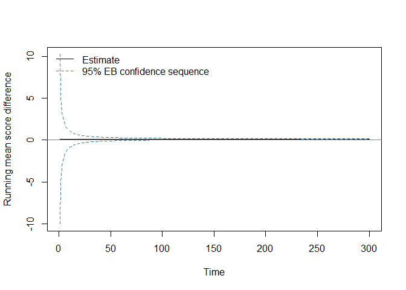

<!-- README.md is generated from README.Rmd. Please edit that file -->

# seqcomp

<!-- badges: start -->

[](https://github.com/alasgarliakbar/seqcomp/actions/workflows/R-CMD-check.yaml)
<!-- badges: end -->

`seqcomp` implements anytime-valid tools for the sequential comparison
of probabilistic forecasters, following the framework of Choe and Ramdas
(2024). Given two competing forecasters and a sequence of binary or
categorical outcomes, the package constructs confidence sequences and
e-processes for the running mean score difference that are valid
simultaneously at every point in time, without requiring a pre-specified
sample size or adjustment for repeated monitoring.

The package provides:

- Positively oriented proper scoring rules (Brier, logarithmic,
  spherical, CRPS, tick loss, QLIKE, Winkler).
- Anytime-valid confidence sequences: Hoeffding-style (Theorem 1, Choe
  and Ramdas 2024) and empirical Bernstein (Theorem 2).
- An asymptotic confidence sequence for unbounded scoring rules
  (Appendix C, Choe and Ramdas 2024).
- Sub-exponential e-processes for sequential hypothesis testing (Theorem
  3).
- Winkler-score tools for one-sided sequential inference with unbounded
  binary scoring rules.
- Lag-handling utilities for multi-step-ahead forecast evaluation via
  stream splitting.
- Predictable-bounds tools for settings where score differences are not
  globally bounded in advance.

All boundary computations (normal mixture, gamma-exponential mixture,
polynomial stitching) are implemented from scratch, with no dependency
on the `confseq` package.

## Installation

The development version can be installed from GitHub:

``` r
# install.packages("pak")
pak::pak("alasgarliakbar/seqcomp")
```

After CRAN acceptance:

``` r
install.packages("seqcomp")
```

## Basic example

`compare_forecasts()` is the main entry point. It computes pointwise
scores, the running mean score difference, a confidence sequence, and
two one-sided e-processes in a single call.

``` r
library(seqcomp)

set.seed(1)
n <- 300
y <- rbinom(n, size = 1, prob = 0.55)

# Forecaster p has some signal; forecaster q always predicts 0.5
p <- ifelse(y == 1, 0.62, 0.38)
q <- rep(0.50, n)

out <- compare_forecasts(
  p            = p,
  q            = q,
  y            = y,
  scoring_rule = "brier"
)

tail(out[, c("t", "estimate", "lower", "upper", "e_pq", "e_qp")])
#>       t estimate      lower     upper    e_pq         e_qp
#> 295 295   0.1056 0.07129320 0.1399068 2681618 2.220446e-16
#> 296 296   0.1056 0.07140910 0.1397909 2824574 2.220446e-16
#> 297 297   0.1056 0.07152422 0.1396758 2975161 2.220446e-16
#> 298 298   0.1056 0.07163857 0.1395614 3133784 2.220446e-16
#> 299 299   0.1056 0.07175215 0.1394478 3300873 2.220446e-16
#> 300 300   0.1056 0.07186498 0.1393350 3476882 2.220446e-16
```

The column `estimate` is the running mean score difference
$\hat{\Delta}_t = t^{-1}\sum_{i=1}^t (S(p_i, y_i) - S(q_i, y_i))$.
Positive values favour `p`; negative values favour `q`. The columns
`lower` and `upper` are the empirical Bernstein confidence sequence
bounds. The columns `e_pq` and `e_qp` are the two one-sided e-process
values; the two-sided rejection threshold at level `alpha = 0.05` is
`2 / 0.05 = 40`.

``` r
plot(
  out$t, out$estimate,
  type = "l",
  ylim = range(c(out$lower, out$upper, 0), finite = TRUE),
  xlab = "Time",
  ylab = "Running mean score difference"
)
lines(out$t, out$lower, lty = 2, col = "steelblue")
lines(out$t, out$upper, lty = 2, col = "steelblue")
abline(h = 0, col = "gray50")
legend(
  "topleft",
  legend = c("Estimate", "95% EB confidence sequence"),
  lty    = c(1, 2),
  col    = c("black", "steelblue"),
  bty    = "n"
)
```



## Scale parameter conventions

Two scale conventions are used throughout, following Choe and Ramdas
(2024) exactly. Theorem 1 (Hoeffding CS) requires
$|\hat{\delta}_i| \leq c$, so `c = 1` is used for Brier or spherical
score differences in $[-1, 1]$. Theorems 2 and 3 (empirical Bernstein CS
and e-process) require $|\hat{\delta}_i| \leq c/2$, so `c = 2` is used
for the same score differences. `compare_forecasts()` applies these
conventions automatically. They differ from the Python `comparecast`
package, which applies the Theorem 2/3 convention throughout.

## Lower-level interface

`compare_forecasts()` is a convenience wrapper. The underlying functions
can be called directly for finer control:

``` r
scores_p <- brier_score(p, y)
scores_q <- brier_score(q, y)

cs  <- cs_bernstein(scores_p, scores_q, alpha = 0.05, c = 2)
ep  <- eprocess(scores_p, scores_q, alpha = 0.05, c = 2)
```

## Background

The statistical methods in `seqcomp` are based on:

- Confidence sequences and time-uniform probability bounds (Howard,
  Ramdas, McAuliffe and Sekhon, 2021).
- E-values and game-theoretic statistics (Ramdas, Grünwald, Vovk and
  Shafer, 2023).
- Sequential forecaster comparison under the weak null hypothesis (Choe
  and Ramdas, 2024).

The package was developed as part of a bachelor’s thesis at the Vienna
University of Economics and Business (WU Vienna).

## Citation

If this package is used in published work, please cite the package
itself and the following papers:

``` r
citation("seqcomp")
```

## References

Choe, Y. J. and Ramdas, A. (2024). Comparing Sequential Forecasters.
*Operations Research*, 72(4), 1368–1387.
<https://doi.org/10.1287/opre.2021.0792>

Howard, S. R., Ramdas, A., McAuliffe, J. and Sekhon, J. (2021).
Time-uniform, nonparametric, nonasymptotic confidence sequences. *The
Annals of Statistics*, 49(2). <https://doi.org/10.1214/20-AOS1991>

Howard, S. R., Ramdas, A., McAuliffe, J. and Sekhon, J. (2020).
Time-uniform Chernoff bounds via nonnegative supermartingales.
*Probability Surveys*, 17, 257–317. <https://doi.org/10.1214/18-PS321>

Ramdas, A., Grünwald, P., Vovk, V. and Shafer, G. (2023). Game-theoretic
statistics and safe anytime-valid inference. *Statistical Science*,
38(4), 576–601. <https://doi.org/10.1214/23-STS894>

Waudby-Smith, I., Arbour, D., Sinha, R., Kennedy, E. H. and Ramdas, A.
(2024). Time-uniform central limit theory and asymptotic confidence
sequences. *The Annals of Statistics*, 52(6).
<https://doi.org/10.1214/24-AOS2408>
