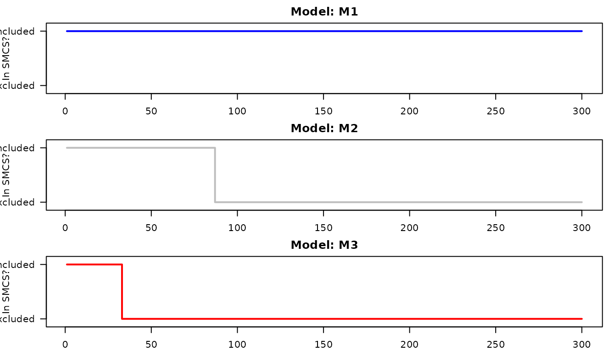

# Comparing Multiple Forecasters with SMCS

``` r

library(seqcomp)
```

## Overview

While
[`compare_forecasts()`](https://alasgarliakbar.github.io/seqcomp/reference/compare_forecasts.md)
evaluates exactly two models, real-world applications often require
comparing an arbitrary number of candidate models ($`m \ge 2`$)
simultaneously.

Evaluating multiple models sequentially introduces a multiple-testing
problem: if you run enough pairwise comparisons over enough time steps,
you will eventually find false “statistically significant” differences
by pure chance.

To solve this, `seqcomp` implements **Sequential Model Confidence Sets
(SMCS)** (Arnold et al., 2026). The SMCS is the set of models that have
not yet been confidently beaten by any other model in the candidate
pool. The package guarantees that the true best model(s) will remain in
the SMCS with probability at least $`1 - \alpha`$ over the entire
evaluation period. *(If you are only comparing two forecasters, we
recommend starting with the [introductory
vignette](https://alasgarliakbar.github.io/seqcomp/articles/seqcomp.md).)*

## Two Notions of Superiority

When comparing multiple models, `seqcomp` tracks two different
definitions of what makes a model “superior”:

1.  **The Strong Null (`smcs_strong`)**: A model is strongly superior if
    it performs at least as well as every other model *at every single
    time step*. If a model is consistently good but has occasional
    severe failures, it will be eliminated from this set.
2.  **The Weak Null (`smcs_weak`)**: A model is weakly superior if it
    performs at least as well as every other model *on average* over
    time. This allows models to remain in the set even if they
    occasionally issue bad forecasts, provided their long-term average
    remains dominant.

## A simple multi-model example

Let’s generate a sequence of binary outcomes and three candidate
forecasters:

- `M1`: A highly accurate forecaster.
- `M2`: A mediocre forecaster that guesses randomly.
- `M3`: A terrible forecaster that is consistently wrong.

``` r

set.seed(2026)
T_sim <- 300
y <- rbinom(T_sim, size = 1, prob = 0.7)

# Create 3 forecasters
forecasts <- matrix(0, nrow = T_sim, ncol = 3)
colnames(forecasts) <- c("M1", "M2", "M3")

forecasts[, "M1"] <- ifelse(y == 1, 0.8, 0.2)   # Highly accurate
forecasts[, "M2"] <- runif(T_sim, 0.4, 0.6)     # Mediocre/random
forecasts[, "M3"] <- ifelse(y == 1, 0.2, 0.8)   # Consistently wrong

head(forecasts)
#>       M1        M2  M3
#> [1,] 0.8 0.5019408 0.2
#> [2,] 0.8 0.5009826 0.2
#> [3,] 0.8 0.5262100 0.2
#> [4,] 0.8 0.4685904 0.2
#> [5,] 0.8 0.5677538 0.2
#> [6,] 0.8 0.4215049 0.2
```

## Compare the forecasts

The easiest workflow for evaluating three or more models is to use
[`compare_multiple_forecasts()`](https://alasgarliakbar.github.io/seqcomp/reference/compare_multiple_forecasts.md).

``` r

multi_cmp <- compare_multiple_forecasts(
  forecasts = forecasts,
  outcomes = y,
  scoring_rule = "brier",
  alpha = 0.05
)

# Printing the object provides a clean summary of which models 
# were excluded and when they first dropped out of the set.
multi_cmp
#> <seqcomp multi-model comparison>
#>   3 models, 300 time steps, alpha = 0.05, scoring rule = 'brier'
#> 
#> -- Strong-null SMCS (Permanent Exclusion) --
#>  model status_at_T first_dropped
#>     M1    included             -
#>     M2    excluded            87
#>     M3    excluded            33
#>    final set size: 3 -> 1
#> 
#> -- Weak-null SMCS (Dynamic Re-entry) --
#>  model status_at_T first_dropped
#>     M1    included             -
#>     M2    excluded            61
#>     M3    excluded            22
#>    final set size: 3 -> 1
#> 
#> Use `x$smcs_strong` / `x$smcs_weak` for full inclusion matrices, or `x$scores` for pointwise scores.
```

While the printed summary gives a quick overview, the underlying object
is a list containing the full time-indexed matrices for further
analysis(alongside metadata such as `alpha` and `scoring_rule`):

- `multi_cmp$scores`: The evaluated pointwise scores for each model.
- `multi_cmp$smcs_strong`: A logical matrix tracking whether each model
  belongs to the strong-null SMCS at time $`t`$.
- `multi_cmp$smcs_weak`: A logical matrix tracking whether each model
  belongs to the weak-null SMCS at time $`t`$.

## Interpreting the SMCS output

[`smcs_strong()`](https://alasgarliakbar.github.io/seqcomp/reference/smcs_strong.md)
maintains a **running intersection** over time: once a model is shown to
violate the null against some competitor, it is excluded permanently.
This matches the strong/uniformly-weak SMCS construction of Arnold,
Gavrilopoulos, Schulz and Ziegel (2026, Section 3.2).

The underlying hypothesis of
[`smcs_weak()`](https://alasgarliakbar.github.io/seqcomp/reference/smcs_weak.md)
(the *time-varying* weak null, Section 3.3) is defined *at* each time
$`t`$, not cumulatively, so a model’s average performance can
legitimately recover after a bad stretch.
[`smcs_weak()`](https://alasgarliakbar.github.io/seqcomp/reference/smcs_weak.md)
therefore returns `smcs`, which can re-admit models that were previously
excluded.

Let’s look at the strong SMCS at the end of the evaluation:

``` r

tail(multi_cmp$smcs_strong)
#>          M1    M2    M3
#> [295,] TRUE FALSE FALSE
#> [296,] TRUE FALSE FALSE
#> [297,] TRUE FALSE FALSE
#> [298,] TRUE FALSE FALSE
#> [299,] TRUE FALSE FALSE
#> [300,] TRUE FALSE FALSE
```

We can visualize how the confidence set shrinks over time by plotting
whether a model is `TRUE` (Included) or `FALSE` (Excluded):

``` r

par(mfrow = c(3, 1), mar = c(2, 4, 2, 1))
colors <- c("blue", "gray", "red")

for (i in 1:3) {
  plot(
    1:T_sim, multi_cmp$smcs_strong[, i], 
    type = "s", col = colors[i], lwd = 2,
    ylim = c(-0.1, 1.1), yaxt = "n", ylab = "In SMCS?",
    main = paste("Model:", colnames(forecasts)[i])
  )
  axis(2, at = c(0, 1), labels = c("Excluded", "Included"), las = 2)
}
```



``` r

par(mfrow = c(1, 1))
```

Notice how quickly the set shrinks:

1.  `M3` (the terrible model) is confidently beaten by `M1` almost
    immediately and drops out of the set.
2.  `M2` (the mediocre model) survives a bit longer, but as evidence
    accumulates, it too is permanently excluded.
3.  `M1` (the true best model) remains in the SMCS for the entire
    duration.

## Using lower-level functions directly

Just like the two-model case, `seqcomp` exposes the underlying
multi-model primitives if you need custom bounds, different scoring
rules, or adaptive betting fractions.

You can compute your own score matrices and pass them directly to
[`smcs_strong()`](https://alasgarliakbar.github.io/seqcomp/reference/smcs_strong.md)
or
[`smcs_weak()`](https://alasgarliakbar.github.io/seqcomp/reference/smcs_weak.md).

``` r

# Manually compute Brier scores
scores_mat <- matrix(0, nrow = T_sim, ncol = 3)
for(i in 1:3) scores_mat[, i] <- brier_score(forecasts[, i], y)

# Construct the Weak SMCS directly
# Brier score differences are bounded in [-1, 1], so we use c_param = 2
res_weak <- smcs_weak(
  scores = scores_mat,
  alpha = 0.05,
  cs_method = "bernstein",
  c_param = 2
)

tail(res_weak$smcs)
#>        [,1]  [,2]  [,3]
#> [295,] TRUE FALSE FALSE
#> [296,] TRUE FALSE FALSE
#> [297,] TRUE FALSE FALSE
#> [298,] TRUE FALSE FALSE
#> [299,] TRUE FALSE FALSE
#> [300,] TRUE FALSE FALSE
```

## Conditionally bounded scores (Tick loss)

Some scoring rules, like tick loss for quantile forecasting, are
unbounded globally but bounded *conditionally* based on the distance
between the forecasts.

For these rules, the strong SMCS requires a dynamically updating 3D
array of bounds and betting fractions. The wrapper
[`compare_multiple_forecasts()`](https://alasgarliakbar.github.io/seqcomp/reference/compare_multiple_forecasts.md)
handles this automatically when `scoring_rule = "tick"`, or you can
construct the arrays manually using
[`build_quantile_betting_arrays()`](https://alasgarliakbar.github.io/seqcomp/reference/build_quantile_betting_arrays.md).

``` r

set.seed(7)
tau <- 0.5

truth <- rnorm(T_sim)
q_forecasts <- cbind(
  M1 = truth + rnorm(T_sim, sd = 0.1),    # accurate
  M2 = rep(0, T_sim),                     # uninformative
  M3 = truth + rnorm(T_sim, sd = 0.1) + 1 # biased
)

tick_cmp <- compare_multiple_forecasts(
  forecasts    = q_forecasts,
  outcomes     = truth,
  scoring_rule = "tick",
  tau          = tau,
  alpha        = 0.05
)
#> Warning in compare_multiple_forecasts(forecasts = q_forecasts, outcomes =
#> truth, : smcs_weak is currently omitted for unbounded tick loss in this wrapper
#> (requires transformation).

tail(tick_cmp$smcs_strong)
#>          M1    M2    M3
#> [295,] TRUE FALSE FALSE
#> [296,] TRUE FALSE FALSE
#> [297,] TRUE FALSE FALSE
#> [298,] TRUE FALSE FALSE
#> [299,] TRUE FALSE FALSE
#> [300,] TRUE FALSE FALSE
```

`smcs_weak` is `NULL` here, since tick-loss score differences are only
conditionally bounded, not uniformly bounded, and
[`smcs_weak()`](https://alasgarliakbar.github.io/seqcomp/reference/smcs_weak.md)
currently requires a fixed uniform bound.
